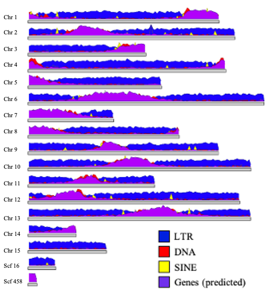
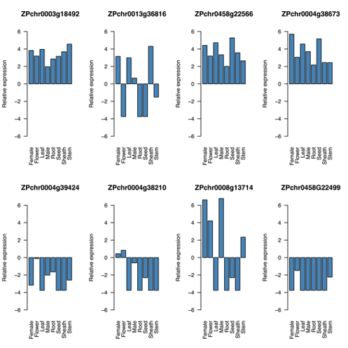
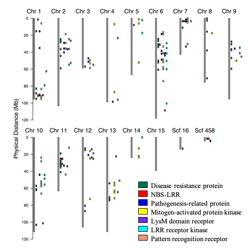

<h1 align="center"><strong>Whole Genome Assembly and Annotation of Northern Wild Rice (<em>Zizania palustris</em> L.), a North American Grain Reveals a Whole Genome Duplication Event within the Species</strong></h1>

This repository supports the work that went into characterizing the Northern Wild Rice (_Zizania palustris_ L.) genome.

Once the manuscript is posted to bioRxiv, that link will be available here.
Upon publication, that link will be shared as well.

Please use this directory to navigate this README to find the scripts for a particular analysis or figure with ease.

## Directory
1. [Figure 1](#Figure-1)
2. [Figure 2](#Figure-2)
3. [Figure 3](#Figure-3)
4. [Supporting Figure S1](#Supporting-Figure-S1)
5. [Supporting Figure S2](#Supporting-Figure-S2)
6. [Supporting Figure S3](#Supporting-Figure-S3)
7. [Supporting Figure S4](#Supporting-Figure-S4)
8. [Supporting Figure S5](#Supporting-Figure-S5)
9. Supporting Figure S6
10. [Supporting Figure S7](#Supporting-Figure-S7)
11. [Supporting Figure S8](#Supporting-Figure-S8)
12. [Supporting Figure S9](#Supporting-Figure-S9)
13. Supporting Figure S10
14. Supporting Figure S11
15. Supporting Figure S12
16. [Supporting Figure S13](#Supporting-Figure-S13)
17. [Supporting Figure S14](#Supporting-Figure-S14)

# Figure 1
## run_repeat_circos.sh
This script generated the Circos plot shown in Figure 1. The figure shows the genome-wide distribution of genes and repetitive elements. The legend was added in PowerPoint. This shell script is used in conjunction with the Circos configuration file which you can find [here](repeat_specific_circos.conf).


# Figure 2
## NWR and major grass species venn diagram


# Figure 3
## karyotype.py
This script was originally written by Haibao Tang and can be found [here](https://github.com/tanghaibao/jcvi). I am including the script here because I modified it in order to create my plots.
1. Line 40 was altered so that ```arg[5]``` (the name we assign to each track in the layout file) is printed in italics. 
2. Line 239 was also changed (dividing vpad by 2 was removed) to make extra room on the margin so that _Zizania palustris_ could be fully written out (versus abbreviating it as _Z. palustris_--which also didn't fit initally--it ran into the representations of the chromosomes.

 

## synteny.py
This script was originally written by Haibao Tang and can be found [here](https://github.com/tanghaibao/jcvi). I am including the script here because I modified it in order to create my plots.
1. Line 61 was modified so that the species label ```args[7]``` will be printed in italics. 
2. I also added another argument ```args[8]``` so that the chromosome label will not be in italics.


# Supporting Figure S1
## add_scalebar_to_annotation_photo.ipynb
The purpose of this code was to add a scale bar to the image of tissues collected for the RNA-seq portion of the study. This work was done in a Jupyter Notebook using Python. The letters were added in PowerPoint.


# Supporting Figure S2
Plots show basic genome assembly statistics

 

## find_zizania_specific_duplications.py
This script filters the ```Duplications.tsv``` file created by OrthoFinder to contain _Zizania_-specific duplications. The script was written to retain only genes which were duplicated once. Genes with more than one additional copy were not retained for simplicity.

## make_duplication_bed_files.py
This script was written to take the original BED files produced by MCscan (```wild_rice.bed``` & ```latifolia.bed```) and filter them (producing new versions) to retain only duplications which were found using OrthoFinder and filtered to contain _Zizania_-specific genes using the script [find_zizania_specific_duplications.py](find_zizania_specific_duplications.py).

# Supporting Figure S3
The script [WR_repeats_karyoplot.R](WR_repeats_karyoplot.R) was used to generate this figure. Y-axis labels were fixed in PowerPoint because we wanted chromosomes 1-15 to have the prefix "Chr" but scaffolds 16 and 458 to have the prefix "Scf" to avoid confusion if they were to have the "Chr" label.



# Supporting Figure S4
This figure came from Tom & Marissa, so we need to find the script that accompanies it. The letters were added in PowerPoint.


# Supporting Figure S5
This combined figure came from multiple R scripts used to parse gene ontology (GO) data and plot the most abundant GO terms. The R scripts used to generate this figure are located in the [gene_ontolgoy](gene_ontology) subdirectory. They include a modified version of the pie chart function. That script ([gene_ontology/modified_pie_function.R](gene_ontology/modified_pie_function.R)) must be loaded when using these scripts using the ```source()``` function. The scripts include that function, but you should make sure that the modified version of the script is in your working directory, otherwise it will not work properly.


# Supporting Figure S7
## NWR relatives venn diagram


# Supporting Figure S8
## dotplot.py
This script was originally written by Haibao Tang and can be found [here](https://github.com/tanghaibao/jcvi). I am including the script here because I modified it in order to create my plots. The following changes were made by hard-coding my desired output into the original script: 
1. The font color of the chromosome labels and positions were changed from grey to black
2. The labels for the x and y axes were changed to _Zizania palustris_ and _Oryza sativa_ (respectively) rather than ```wild_rice``` and ```oryza``` (which are the BED file names)
3. The xlimit was slightly increased (along with the length of chr 15, scf 16, and scf 458 (in order to make the chromosome labels legible).


# Supporting Figure S9
## We plotted the counts per million (cpm) data from the tissue-specific expression work to generate this figure using the script [plot_putative_shattering_gene_expression.R](plot_putatitive_shattering_gene_expr.R)


# Supporting Figure S13
## We used the script [plot_resistance_gene_distribution.R](plot_resistance_gene_distribution.R) to plot the distribution of disease resistance genes (and related genes) from the predicted function of our annotated genes.



# Supporting Figure S14
## run_downsampled_circos.sh
This script generates the Circos plot from the Supporting Figures that features SNP density after downsampling. The legend was added in PowerPoint. This shell script is used in conjunction with the Circos configuration which you can find [here](downsampled_circos.conf). The shell scripts that we used to perform the downsampling can be found [here](downsampling_scripts).


