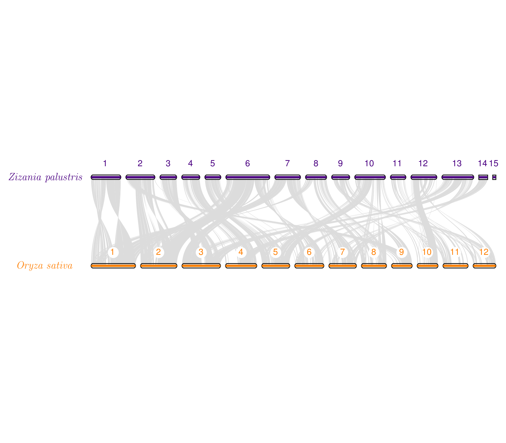
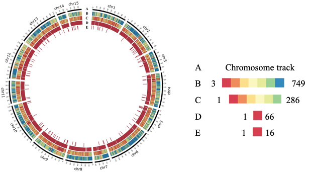

# README for genome_assembly
## Annotation of the _Zizania palustris_ genome


## dotplot.py
This script was originally written by Haibao Tang and can be found [here](https://github.com/tanghaibao/jcvi). I am including the script here because I modified it in order to create my plots. The following changes were made by hard-coding my desired output into the original script: 
1. The font color of the chromosome labels and positions were changed from grey to black
2. The labels for the x and y axes were changed to _Zizania palustris_ and _Oryza sativa_ (respectively) rather than 'wild_rice' and 'oryza' (which are the BED file names)
3. The xlimit was slightly increased (along with the length of chr 15, scf 16, and scf 458 (in order to make the chromosome labels legible).


## find_zizania_specific_duplications.py
This script filters the ```Duplications.tsv``` file created by OrthoFinder to contain _Zizania_-specific duplications. The script was written to retain only genes which were duplicated once. Genes with more than one additional copy were not retained for simplicity.

## karyotype.py
This script was originally written by Haibao Tang and can be found [here](https://github.com/tanghaibao/jcvi). I am including the script here because I modified it in order to create my plots.
1. Line 40 was altered so that ```arg[5]``` (the name we assign to each track in the layout file) is printed in italics. 
2. Line 239 was also changed (dividing vpad by 2 was removed) to make extra room on the margin so that _Zizania palustris_ could be fully written out (versus abbreviating it as _Z. palustris_--which also didn't fit initally--it ran into the representations of the chromosomes.

 

## make_duplication_bed_files.py
This script was written to take the original BED files produced by MCscan (```wild_rice.bed``` & ```latifolia.bed```) and filter them (producing new versions) to retain only duplications which were found using OrthoFinder and filtered to contain _Zizania_-specific genes using the script _find_zizania_specific_duplications.py_.

## run_downsampled_circos.sh
This script generates the Circos plot from the Supporting Figures that features SNP density after downsampling. The legend was added in PowerPoint. This shell script is used in conjunction with the Circos configuration which you can find [here](downsampled_circos.conf). The shell scripts that we used to perform the downsampling can be found [here](downsampling_scripts).



## run_repeat_circos.sh
This script generated the Circos plot shown in Figure 1. The figure shows the genome-wide distribution of genes and repetitive elements. The legend was added in PowerPoint. This shell script is used in conjunction with the Circos configuration file which you can find [here](repeat_specific_circos.conf).


## synteny.py
This script was originally written by Haibao Tang and can be found [here](https://github.com/tanghaibao/jcvi). I am including the script here because I modified it in order to create my plots.
1. Line 61 was modified so that the species label ```args[7]``` will be printed in italics. 
2. I also added another argument ```args[8]``` so that the chromosome label will not be in italics.


## venn diagrams
### NWR and major grass species


### NWR relatives


