<h1 align="center"><strong>Whole Genome Assembly and Annotation of Northern Wild Rice (<em>Zizania palustris</em> L.), a North American Grain Supports a Whole Genome Duplication Event within the Species</strong></h1>

This repository supports the work that went into characterizing the Northern Wild Rice (_Zizania palustris_ L.) genome.

Once the manuscript is posted to bioRxiv, that link will be available here.
Upon publication, that link will be shared as well.

There are no scripts for the genome assembly itself because that work was performed by [Dovetail Genomics](https://dovetailgenomics.com). The genome has been deposited at the United States [National Center for Biotechnology Information (NCBI)](https://www.ncbi.nlm.nih.gov/bioproject) under BioProject number PRJNA600525. The annotation work was carried out by Marissa Macchietto and Thomas Kono and those scripts can be found [here]().

Please use the directory to navigate this README to find the scripts for a particular analysis or figure with ease. This README is best viewed in Light Mode.

## Directory
1. [Figure 1](#Figure-1)
2. [Figure 2](#Figure-2)
3. [Figure 3](#Figure-3)
4. [Figure 4](#Figure-4)
5. [Supporting Figure S1](#Supporting-Figure-S1)
6. [Supporting Figure S2](#Supporting-Figure-S2)
7. [Supporting Figure S3](#Supporting-Figure-S3)
8. [Supporting Figure S4](#Supporting-Figure-S4)
9. [Supporting Figure S5](#Supporting-Figure-S5)
10. [Supporting Figure S6](#Supporting-Figure-S6)
11. [Supporting Figure S7](#Supporting-Figure-S7)
12. [Supporting Figure S8](#Supporting-Figure-S8)
13. [Other scripts](#Other-scripts)

# Figure 1
This script generated the [Circos](http://circos.ca) plot shown in Figure 1. The figure shows the genome-wide distribution of genes and repetitive elements. The legend was added in PowerPoint. This shell script [run_main_circos.sh](circos/run_main_circos.sh) is used in conjunction with the Circos configuration file which you can find [here](circos/repeat_specific_circos.conf).

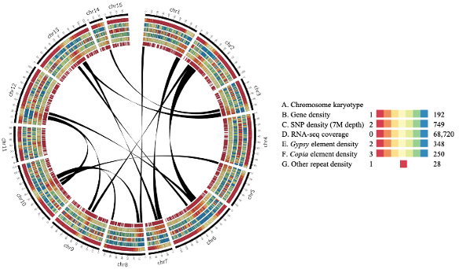

# Figure 2
## Figure 2A
This figure shows the phylogenetic relationship between 20 species used in the initial OrthoFinder analysis. The data to make the tree comes from OrthoFinder and the tree was created using [Dendroscope](https://uni-tuebingen.de/fakultaeten/mathematisch-naturwissenschaftliche-fakultaet/fachbereiche/informatik/lehrstuehle/algorithms-in-bioinformatics/software/dendroscope/). This is not a command-line program, so there is not code to share, but the file we used as input fo the program was [SpeciesTree_rooted.txt](SpeciesTree_rooted.txt). The version of the file with node labels is called [SpeciesTree_rooted_node_labels.txt](SpeciesTree_rooted_node_labels.txt). Divergence times from OrthoFinder were added manually and are in units of million years ago (MYA).

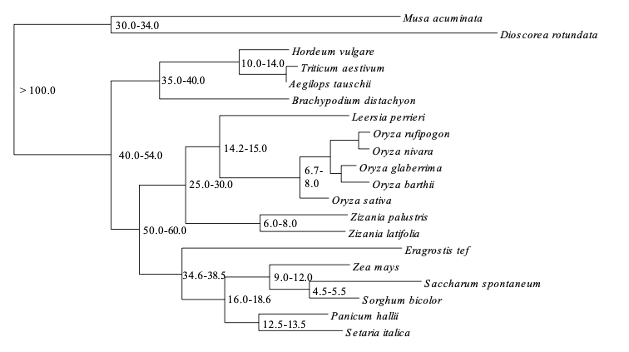

Related to this figure, we estimated the divergence time between _Z. palustris_ and _O. sativa_. To estimate the divergence time, we used the program ```mcmctree``` from [Phylogenetic Analysis by Maximum Liklihood (PAML](http://abacus.gene.ucl.ac.uk/software/paml.html) version 4. The script to do this is [run_paml.sh](run_paml.sh).

## Figure 2B
This figure shows the number of orthogroups in common with (and private to) NWR and four other major grass species (_Oryza sativa_, _Zea mays_, _Sorghum bicolor_, and _Brachypodium distachyon_). The data come from an independent run of OrthoFinder so that the orthogroup counts shown in the figure would only include orthogroup shared by these species and none from the larger set of 20 species shown in the species tree. (**Note:** each orthogroup may contain one or more genes.) The native ```venn.diagram``` function from the [VennDiagram](https://cran.r-project.org/web/packages/VennDiagram/VennDiagram.pdf) package does not use a comma as a separator for the thousands place, so we modified the function and saved the script as [modified_venn_diagram.R](modified_venn_diagram.R) to force the function to use a comma separator. The script used to generate this figure is called [venn_diagram_orthogroups.R](venn_diagram_orthogroups.R). It uses the ```source()``` function to call the modified version of the ```venn.diagram``` function. You must include the [modified_venn_diagram.R](modified_venn_diagram.R) script in your working directory (or give the path to its location) in order for it to function properly.

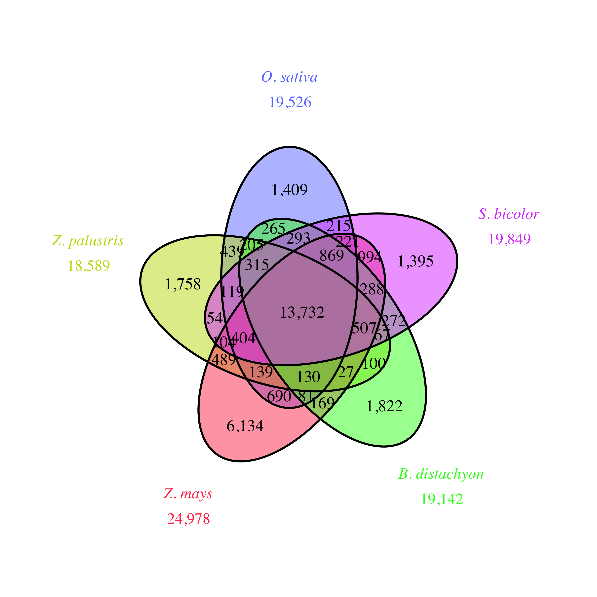

## Figure 2C
**Figure 2C** was created using the MCscan program ([run_jcvi.sh](run_jcvi.sh)). I called the program JCVI in the script name rather than MCscan because the scripts are found in a directory called jcvi in the GitHub repository for the MCscan code. You should use the [seqids](synteny_figures/zp_os_seqids) and [layout](synteny_figures/zp_os_layout) files in conjuntion with [run_jcvi.sh](run_jcvi.sh), but note that you should just call them seqids and layout; and sequester them away from the other seqids and layout files used for the comparison with _Z. latifolia_. I changed the names here only so that the files would not have the same name which would overwrite the other.

The [karyotype.py](karyotype.py) script was originally written by Haibao Tang and can be found [here](https://github.com/tanghaibao/jcvi/blob/main/jcvi/graphics/karyotype.py). I am including the script here because I modified it in order to create my plots.
1. Line 40 was altered so that ```arg[5]``` (the name we assign to each track in the layout file) is printed in italics. 
2. Line 239 was also changed (dividing vpad by 2 was removed) to make extra room on the margin so that _Zizania palustris_ could be fully written out (versus abbreviating it as _Z. palustris_--which also didn't fit initally--it ran into the representations of the chromosomes.


# Figure 2D
This figure was created using the [MCscan](https://github.com/tanghaibao/jcvi/wiki/MCscan-(Python-version)#pairwise-synteny-search) program. The script that I ran on the server was [run_jcvi.sh](run_jcvi.sh). I called the program JCVI in the script name rather than MCscan because the scripts are found in a directory called jcvi in the [GitHub repository for the MCscan code](https://github.com/tanghaibao/jcvi/tree/main/jcvi).

The [dotplot.py](dotplot.py) script was originally written by Haibao Tang and can be found [here](https://github.com/tanghaibao/jcvi). I am including the script here because I modified it in order to create my plots. The following changes were made by hard-coding my desired output into the original script: 
1. The font color of the chromosome labels and positions were changed from grey to black
2. The labels for the x and y axes were changed to _Zizania palustris_ and _Oryza sativa_ (respectively) rather than ```wild_rice``` and ```oryza``` (which are the ```BED``` file names)
3. The xlimit was slightly increased (along with the length of chr 15, scf 16, and scf 458 (in order to make the chromosome labels legible).

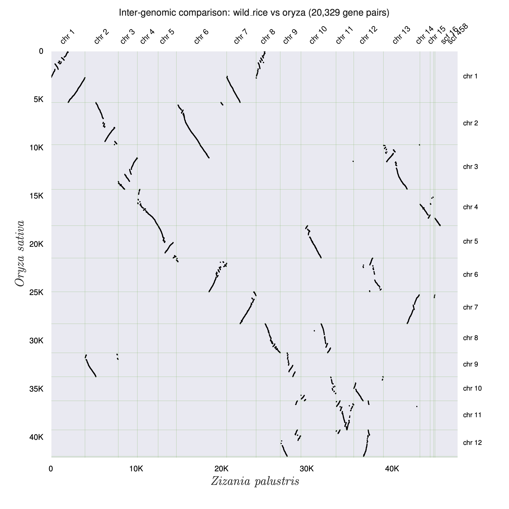

## Figure 2E
The [synteny.py](synteny.py) script was originally written by Haibao Tang and can be found [here](https://github.com/tanghaibao/jcvi/graphics/synteny.py). I am including the script here because I modified it in order to create my plots. The shell script that I wrote to generate the figure is called [run_micro-collinearity.sh](run_micro-collinearity.sh). The [blocks.layout](synteny_figures/blocks.layout) file should be included with [run_micro-collinearity.sh](run_micro-collinearity.sh) to work properly.
1. Line 61 was modified so that the species label ```args[7]``` will be printed in italics. 
2. I also added another argument ```args[8]``` so that the chromosome label will not be in italics.


This figure shows one of the genes important for shattering called _shattering4_ (_sh4_) in _O. sativa_. _sh4_ is in the center and we opted to plot 10 genes on other side of _sh4_ in _O. sativa_ as well as its putative ortholog in _Z. palustris_. The green/blue colors indicate which strand the gene exists on.

# Figure 2F
Like **Figure 2C**, **Figure 3F** was created using the MCscan program ([run_jcvi_with_latifolia.sh](run_jcvi_with_latifolia.sh)). The script is eseentially the same, except that it compares NWR to _Z. latifolia_ rather than _O. sativa_. I called the program JCVI in the script name rather than MCscan because the scripts are found in a directory called jcvi in the GitHub repository for the MCscan code. The [layout](synteny_figures/zp_zl_layout) and [seqids](synteny_figures/zp_zl_seqids) files are used by the script and must be in the same directory as [run_jcvi_with_latifolia.sh](run_jcvi_with_latifolia.sh) to work properly. Like the case for the seqids and layout files for showing synteny between _Z. palustris_ and _O. sativa_ in Figure 2C, just call the files seqids and layout--but make sure they are kept separate.

The [karyotype.py](karyotype.py) script was originally written by Haibao Tang and can be found [here](https://github.com/tanghaibao/jcvi/graphics/karyotype.py). I am including the script here because I modified it in order to create my plots.
1. Line 40 was altered so that ```arg[5]``` (the name we assign to each track in the layout file) is printed in italics. 
2. Line 239 was also changed (dividing vpad by 2 was removed) to make extra room on the margin so that _Zizania palustris_ could be fully written out (versus abbreviating it as _Z. palustris_--which also didn't fit initally--it ran into the representations of the chromosomes.

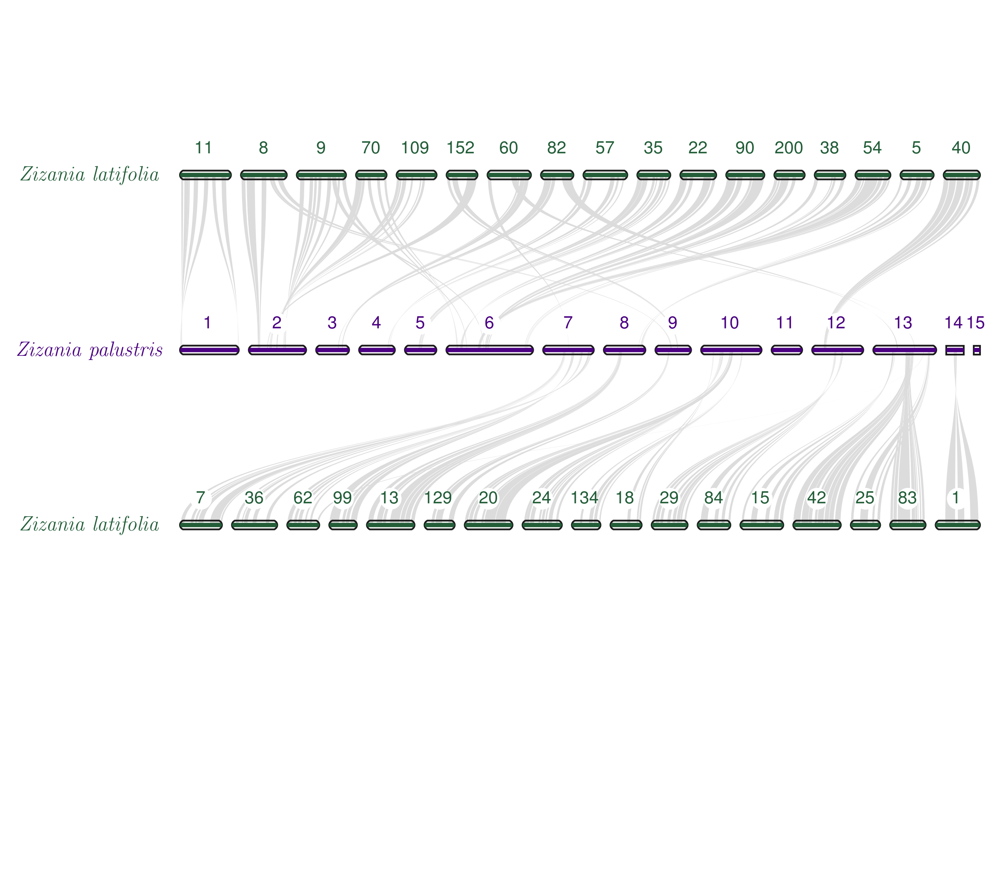

# Figure 3
This figure shows the distribution of synonymous substitution rates and ratios of orthologs between _Z. palustris_ and _O. sativa_; and between _Z. palustris_ and _Z. latifolia_.

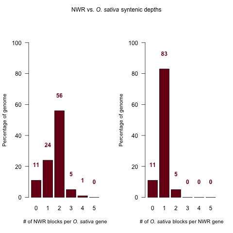 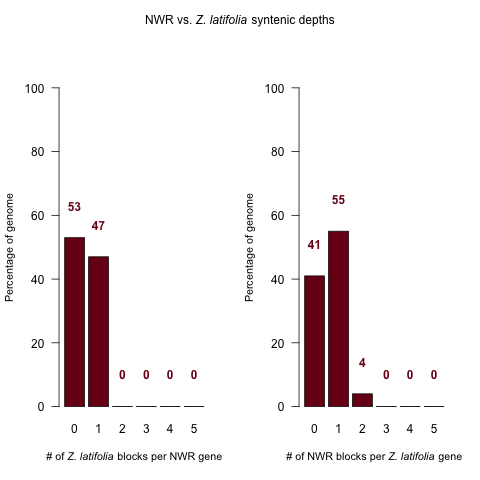 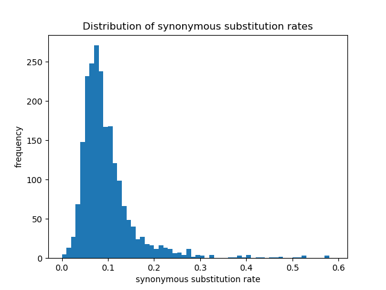

# Figure 4
This script generated the [Circos](http://circos.ca) plot shown in Figure 4. The figure shows SNP density at 2-, 4-, and 8-fold downsampling levels. The legend was added in PowerPoint. This shell script [run_downsampled_circos.sh](circos/run_downsampled_circos.sh) is used in conjunction with the Circos configuration file which you can find [here](circos/downsampled_circos.conf). The scripts used to find SNPs (and thus allow us to calculate their density) can be found [here](downsampling_scripts).


# Supporting Figure S1
The purpose of this code was to add a scale bar to the image of tissues collected for the RNA-seq portion of the study. This work was done in a Jupyter Notebook using Python. The Jupyter Notebook file is [add_scalebar_to_annotation_photo.ipynb](add_scalebar_to_annotation_photo.ipynb). The letters were added in PowerPoint.

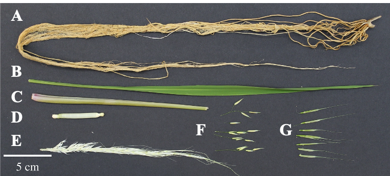

# Supporting Figure S2
The script [get_pacbio_seqids.sh](pacbio_read_length/get_pacbio_seqids.sh) extracts the headers/SeqIDs from each ```FASTQ``` file containing the PacBio reads and writes the headers/SeqIDs to a plain text file and concatenates all eight of these files into a single text file called ```all_headers_concat.txt```. The python script [get_pacbio_read_lengths.py](pacbio_read_length/get_pacbio_read_lengths.py) is launched using the shell script [run_get_pacbio_read_lengths.sh](pacbio_read_length/run_get_pacbio_read_lengths.sh). The python script [get_pacbio_read_lengths.py](pacbio_read_length/get_pacbio_read_lengths.py) not only extracts the length of each PacBio read from the file ```all_headers_concat.txt```, but it plots them using a histogram (shown below). The file name of the plot has been hard-coded into the python script.


# Supporting Figure S3
Plots show basic genome assembly statistics

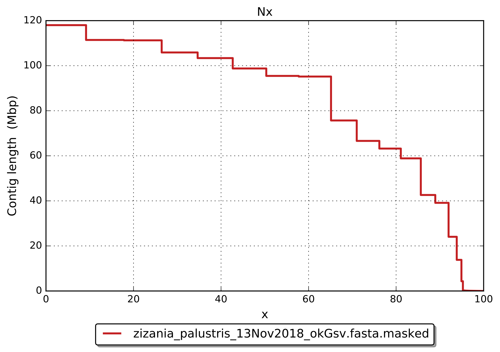 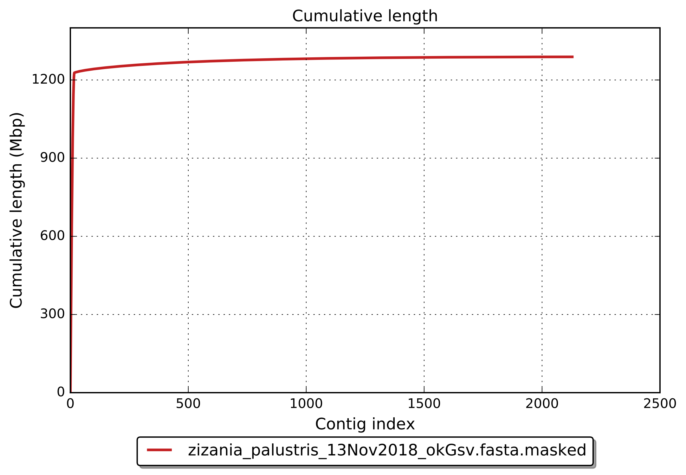

# Supporting Figure S4
The script [WR_repeats_karyoplot.R](WR_repeats_karyoplot.R) was used to generate this figure. Y-axis labels were fixed in PowerPoint because we wanted chromosomes 1-15 to have the prefix "Chr" but scaffolds 16 and 458 to have the prefix "Scf" to avoid confusion if they were to have the "Chr" label.

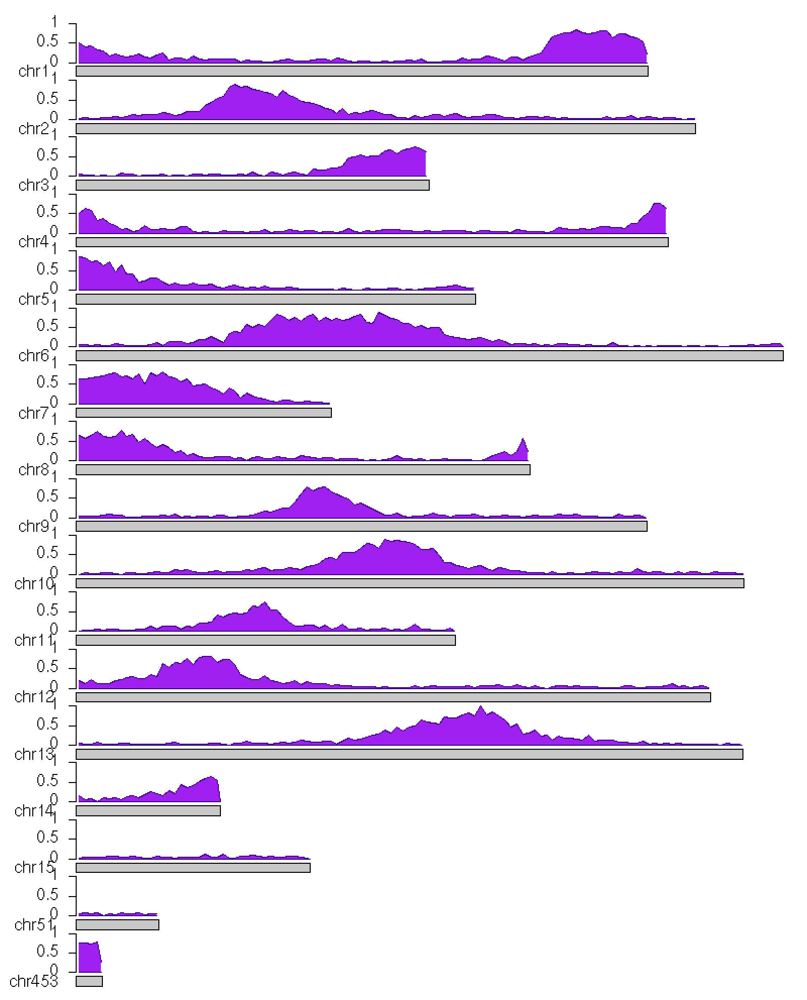
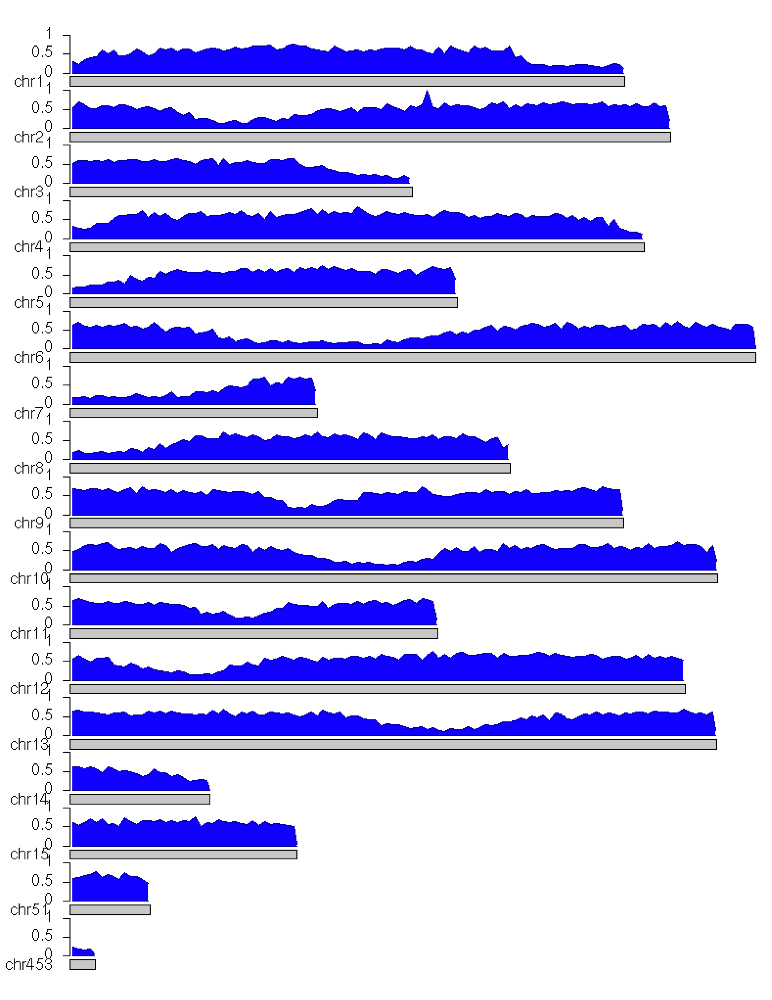
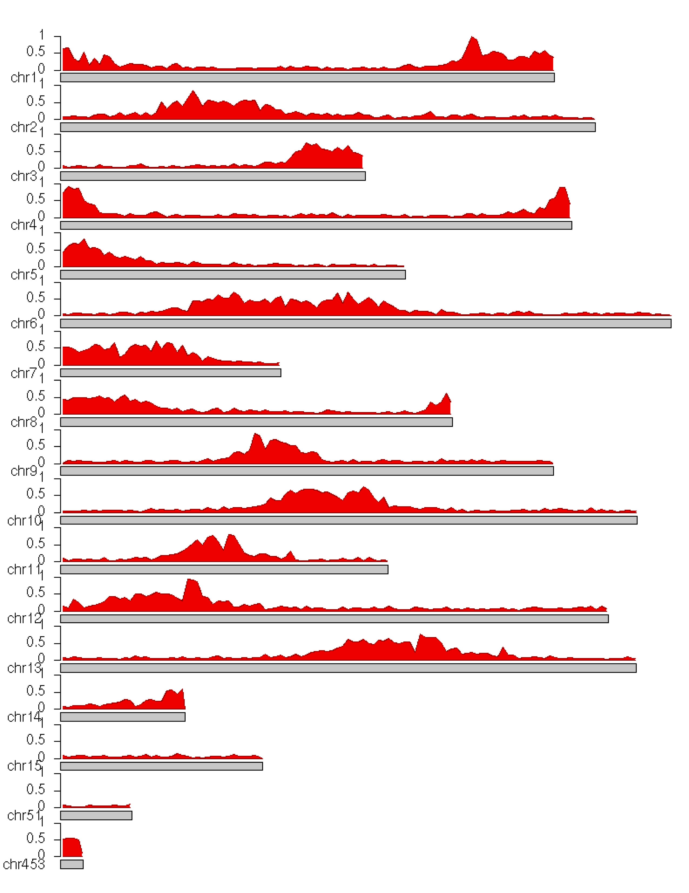
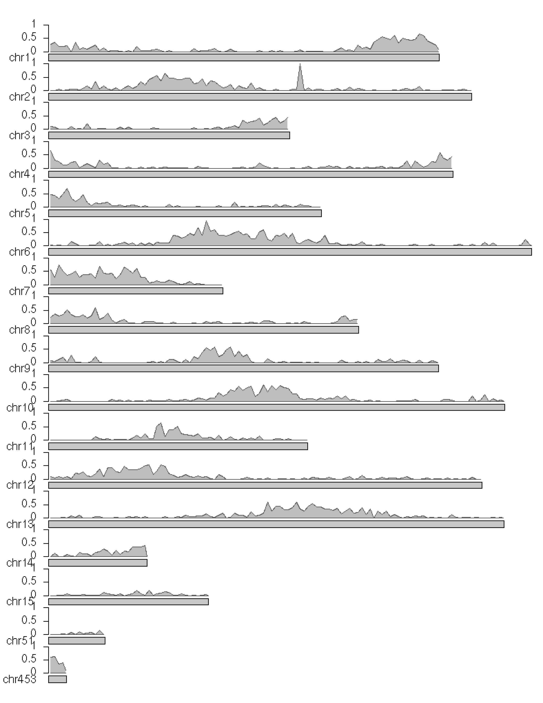

# Supporting Figure S5
This figure came from Tom & Marissa, so we need to find the script that accompanies it. The letters were added in PowerPoint.

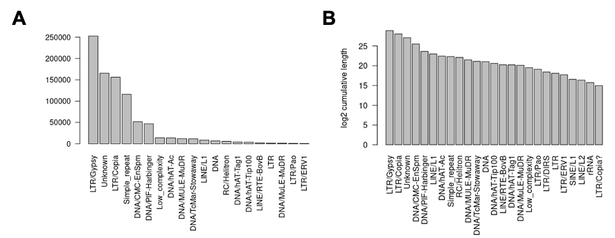

# Supporting Figure S6
This combined figure came from multiple R scripts used to parse gene ontology (GO) data and plot the most abundant GO terms. The R scripts used to generate this figure are located in the [gene_ontolgoy](gene_ontology) subdirectory. They include a modified version of the pie chart function. That script ([modified_pie_function.R](gene_ontology/modified_pie_function.R)) must be loaded when using these scripts using the ```source()``` function. You should make sure that the modified version of the script is in your working directory, otherwise it will not work properly.

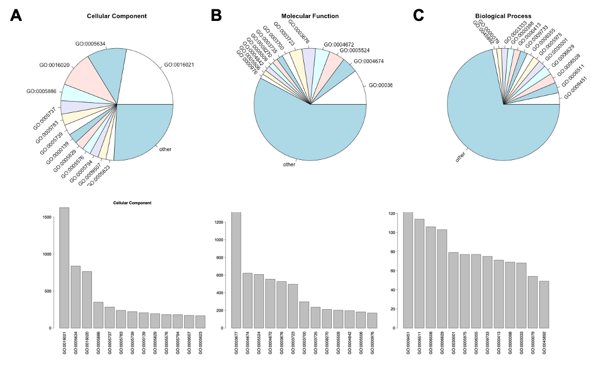

# Supporting Figure S7
The point of this figure was to create a secondary version of the venn diagram in Figure 2B using rice relatives instead of major grass species. _O. sativa_ is the exception because, like _Z. palustris_, it is featured in both venn diagrams. _O. glaberrima_ and _O. rufipogon_ were included instead of _O. barthii_ and _O. nivara_ because those pairs of species (_O. glaberrima_ + _O. barthii_ and _O. rufipogon_ + _O. nivara_) are not too distantly related so we get the same evolutionary relationship and we wanted to avoid a more cluttered figure.

Like the venn diagram in Figure 2B, we used the modified ```venn.diagram``` fuction found in the [modified_venn_diagram.R](modified_venn_diagram.R) script to use commas as a thousands separator. The script used to create this figure is called [venn_diagram_orthogroups_with_rice_relatives.R](venn_diagram_orthogroups_with_rice_relatives.R). The script uses the ```source()``` function to call the modified version of the ```venn.diagram``` function. Ensure that the [modified_venn_diagram.R](modified_venn_diagram.R) script is in your working directory (or give the path to its location) in order for it to function properly.


We were interested in investigating the types of genes that are unique to _Z. palustris_ so we used the script [get_unique_NWR_genes.py](identify_unique_NWR_genes/get_unique_NWR_genes.py) to extract the gene names based on their orthogroup IDs. The orthogroup IDs were obtained by parsing the Orthogroup.GeneCount.tsv file so that we would get orthogroups for which _O. sativa_, _O. glbarrima_, _O. rufipogon_, and _Z. latifolia_ had a count of "0" while _Z. palustris_ had a count greater than "0". This resulted in 1,731 orthogroup IDs as expected from the venn diagram. Our script [get_unique_NWR_genes.py](identify_unique_NWR_genes/get_unique_NWR_genes.py) uses the text file [NWR_unique_orthogroup_list.txt](identify_unique_NWR_genes/NWR_unique_orthogroup_list.txt) containing these 1,731 orthogroup IDs (one per line) and extracts SeqIDs (using BioPython) from the orthogroup protein ```FASTA``` files located in the OrthoFinder output ```Orthogroup_Sequences``` directory. The output contains 6,624 gene names which are found in [this](identify_unique_NWR_genes/list_of_NWR_unique_genes.txt) file. There is no associated shell script to launch this python script. Instead, I just ran it on the command line. First, I loaded python 3 with the command ```module load python3```. Second, I ran the script with the following command:
```
python get_unique_NWR_genes.py NWR_unique_orthogroup_list.txt list_of_NWR_unique_genes.txt
```

**Note:** the file names for ```sys.argv[1]``` and ```sys.argv[2]``` can really be anything you choose, but since ```sys.argv[1]``` is the input for the python script, it must exist. The file name for ```sys.argv[2]``` is somewhat arbitrary, but it should be meaningful.

# Supporting Figure S8
This figure is for the tissue specificity work. Figures were combined and letters added in PowerPoint to make the compound figure in the manuscript.

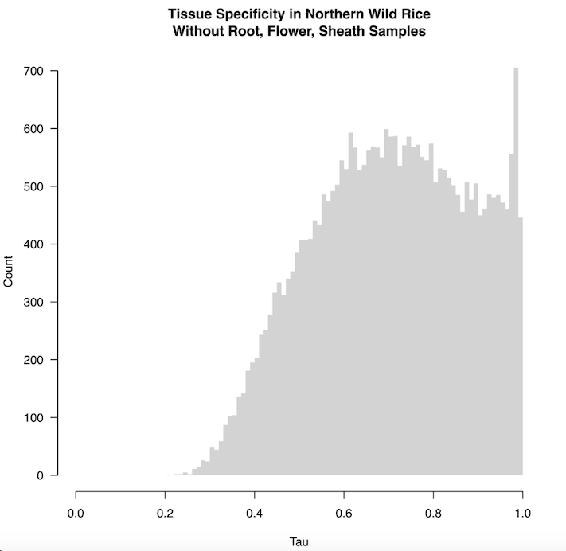 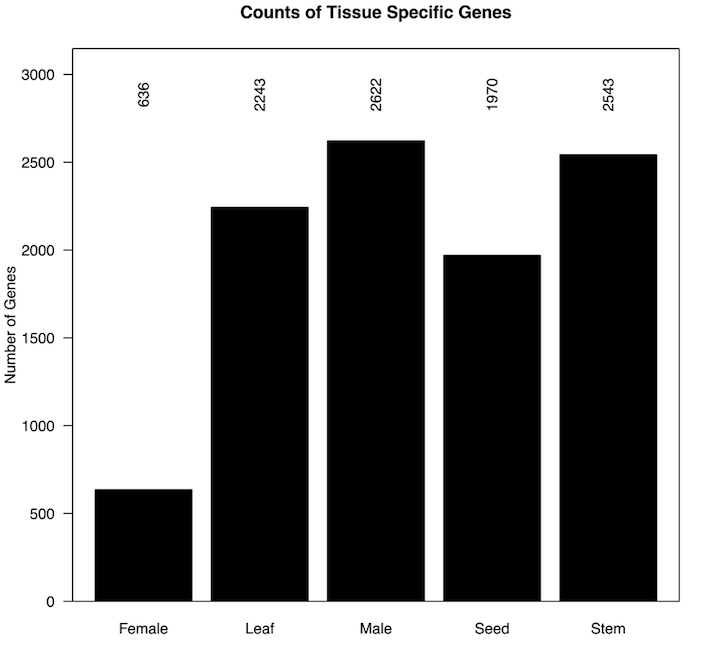 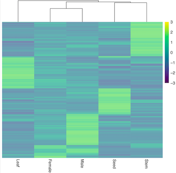


# Other scripts

## BLAST for shattering genes
The file [blast_for_shattering_genes.txt](blast_for_shattering/blast_for_shattering_genes.txt) contains the commands used to detect shattering genes in NWR using sequences from _Oryza_ species. These commands were carried out on the command line and not submitted to run through the scheduling system - so there is no PBS or SLURM header. The input ```FASTA``` files and BLAST output files are also located in the [blast_for_shattering](blast_for_shattering) subdirectory.

## find_zizania_specific_duplications.py
This script filters the ```Duplications.tsv``` file created by OrthoFinder to contain _Zizania_-specific duplications. The script was written to retain only genes which were duplicated once. Genes with more than one additional copy were not retained for simplicity.
