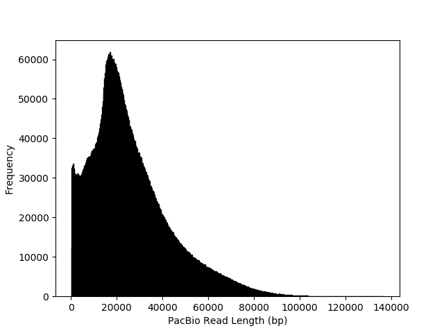

# README

The script [get_pacbio_seqids.sh](get_pacbio_seqids.sh) extracts the headers/SeqIDs from each ```FASTQ``` file containing the PacBio reads and writes the headers/SeqIDs to a plain text file and concatenates all eight of these files into a single text file called ```all_headers_concat.txt```. The python script [get_pacbio_read_lengths.py](get_pacbio_read_lengths.py) is launched using the shell script [run_get_pacbio_read_lengths.sh](run_get_pacbio_read_lengths.sh). The python script [get_pacbio_read_lengths.py](get_pacbio_read_lengths.py) not only extracts the length of each PacBio rad from the file ```all_headers_concat.txt```, but it plots them using a histogram (shown below). The file name of the plot has been hard-coded into the python script.


